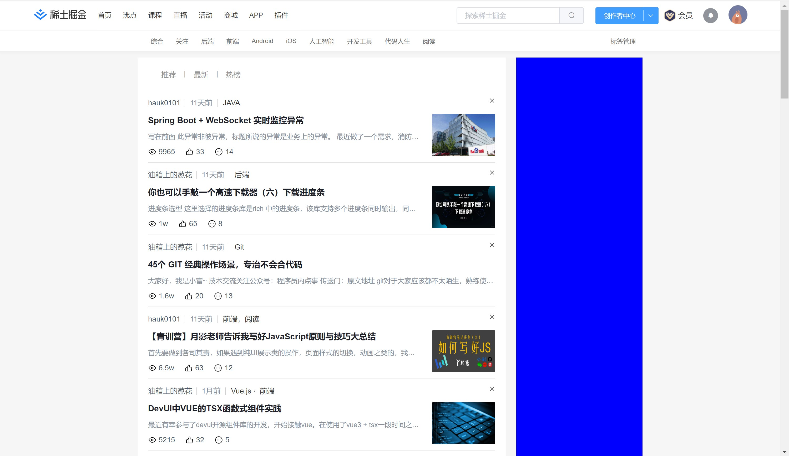

### 临时进度po

 
1.响应式基本完成
2.无限滚动部分完成，利用nodejs操作mysql数据库，数据库正在想办法传到云端
3.无限滚动部分点击事件完成大半

### 稀土掘金官网
1. 顶部导航
2. 导航底部小标签
3. 主体内容

### Project setup
```
npm install
```

### 项目依赖搭建(以下是已安装的依赖)
1. vue create juejin
2. vue add element
3. npm i axios -s
4. npm i less@3.9.0 less-loader@5.0.0
3. npm i vue-router@3
5. npm i vuex@3

### 项目初始化
1. 删除无用组件
2. css初始化 本地或线上(暂时使用本地文件)
3. less文件夹中的clear.less是手写的快速创建BFC插件，如需使用，则在less样式区域使用@import '../......'进行引入后，在需要创建BFC的样式上调用clearfix()即可

### 后台
1. 基于node.js + Express

### element-ui
目前知识按需引入了部分element-ui组件
1. 导航区的搜索框、创作者中心、消息提醒按钮

### 组件结构分析
src---
- assets中存放着静态资源，如css、less和图片
- compons中存放一般组件
- pages中存放路由组件，一个路由组件中包含多个子组件，可以以文件夹的方式存放
- plugins存放插件
- router存放路由规则文件
src---

app---组件中展示的是layout视图组件，layout通过路由引入
	layout---路由组件(router-view)，展示的是navi组件以及导航内容区视图组件
		navi---这么奇怪的命名是因为本来想用nav，但nav是关键字(分为两大块，一块是最左侧的掘金logo，一块是由首页开始一直到最右侧的头像部分，即是导航部分)
			- 掘金logo
			- 导航部分
				- 左侧导航列表 - 路由组件(router-link)，
				- 右侧组件
					- 搜索框 - 一般组件，search.vue
					- 下拉菜单 - 一般组件，scrollMenu.vue
					- 会员
					- 消息提醒
					- 头像
				- 右侧组件
			- 导航部分
		navi---
		导航内容区视图组件---路由组件(router-view)，展示的是navi中左侧导航列表所对应的内容视图
		- home
			- 标签导航列表视图组件---路由组件(router-view)目前是静态组件，后续需要配上路由规则
				- homeTags.vue
			- 标签导航列表视图组件
			- 标签对应的内容视图，后续补充
		- home
		- pins
		- course
			- 标签导航列表视图组件---路由组件(router-view)目前是静态组件，后续需要配上路由规则
    			- courseTags.vue 
			- 标签对应的内容视图，后续补充
		- course
		- live
		- events
		- 商城、app、插件不参与这里的路由规则(他们是直接跳转到新的页面)
		导航内容区视图组件---
	layout---
app---

### 页面布局
1.layout是整个主页面的视图容器，其他页面还有个人中心，vip，创作者中心，消息提醒等页面，暂时未布置视图容器
2.主页导航部分在屏宽
	- 1270 ~ 1350，隐藏APP和插件选项，并减小搜索框宽度；
	- 1190 ~ 1270，隐藏"会员"；
	- 1070 ~ 1190，隐藏导航列表并拉伸搜索框；
	- 960 ~ 1070，减小搜索框；
	- 800 ~ 960，隐藏导航区会员按钮，以及内容区右侧的广告及排行榜组件；
	- 660 ~ 800，隐藏创作者中心；
	- 640 ~ 660，标签导航路由出现横向滑块；
	- 345 ~ 640，隐藏稀土掘金logo并减小搜索框宽度；
	- <345时，隐藏搜索框
3.由于能力不够，vue中使用媒体查询的方法还没整明白，会的小伙伴欢迎在群内讨论

