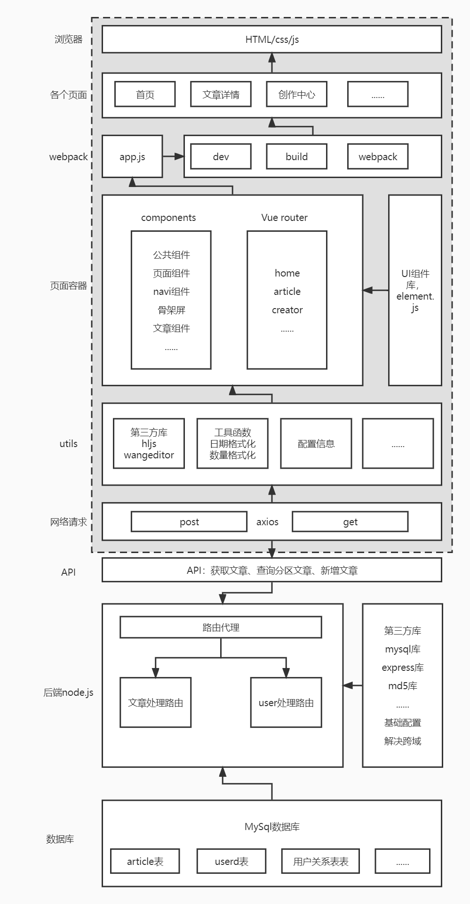

### 仿稀土掘金官网-项目介绍

 
1.借鉴掘金官网样式与功能，实现的功能有：无限滚动的文章列表、首页响应式布局、文章代码高亮、文章发表功能、首页文章展示排序、首页文章按关键词展示、前后端交互...  
2.技术栈：js+less+Vue2+VueRouter+Elementjs+Node.js+mysql  
3.项目服务器地址：http://47.92.135.202:8080/  

### 功能模块
1. 顶部导航栏、响应式布局
2. 首页文章无限滚动、文章排序、文章按分区展示
3. 文章详情页、代码高亮、沉浸模式、文章发表（基于wangeditor）
4. 沸点、创作者中心页面
5. 后端node.js+express从mysql读取数据、查找数据、增加数据

### 项目初始化命令
```
npm install //安装依赖
npm run serve //运行项目
cd ../server //进入后端服务器目录
node app.js //开启后端服务器
//愉快的玩耍
```

### 项目架构
 

### 项目代码介绍
代码量比较庞大，在这里挑选几个项目要点涉及到的代码进行展示：  
1.无限滚动
```
    <!-- 瀑布流 -->
    <div :class="{ waterfall: true, 'waterfall-react': sidebaron }" ref="scrollBox">
        <!-- 骨架屏组件 -->
        <SkeletonVue :height="150" :class="{ 'Skeleton': !sidebaron, 'Skeleton-react': sidebaron }" v-if="isskeleton">
        </SkeletonVue>
        <!-- 文章概览组件List，对后端传来的文章列表articlearr进行for循环 -->
        <List v-for="(item, index) in articlearr" :key="index" :postid="item.id" :authorname="item.username"
            :title="item.title" :coverimg="item.photo"
            :abstract="item.abstract == 'null' ? item.content : item.abstract" :date="item.posttime"
            :keywords="item.keywords" :comment="item.replycount" :likecount="item.followcount"
            :viewcount="item.viewcount">
        </List>
        <h3 v-if="istip" :class="{ 'Skeleton': !sidebaron, 'Skeleton-react': sidebaron }"
            style="text-align: center; margin:20px 0">没有更多了</h3>
    </div>
```
```
<script>
import List from '../../components/List.vue'
import SkeletonVue from '../../components/Skeleton.vue';
import { getarticleAPI } from '../../api/getarticleAPI'

export default {
    data() {
        return {
            articlearr: [],//文章列表
            isloading: false,//向后端请求文章
            loadheight: 200,//加载余量阈值
            index: 0,
            num: 10,
            isskeleton: true,
            istip: false,//提示：没有更多了
        }
    },
    components: {
        List,
        SkeletonVue,
    },
    methods: {
        // 重置索引、列表等
        reSet() {
            this.index = 0
            this.articlearr = []
            this.isskeleton = true
            this.istip = false
        },
        // 查询所有文章
        async getArticle() {
            // 首页列表排序匹配，order表示传给后方的排序依据,篇幅有限，在这里省略了排序switch代码
            let order
            // 。。。省略
            order = 'recommend'
            // 获取文章列表
            const res = await getarticleAPI(this.index, this.num, order)
            if (res.code !== 201) {
                this.isskeleton = false
                this.istip = true
                return
            }
            // 后端传来的文章存入数组
            this.articlearr = [...this.articlearr, ...res.data]
            // sql查询索引增加
            this.index = this.index + this.num
            this.isloading = false
            this.isskeleton = false
        },
        // 防抖函数
        debounce(fn, delay) {
            let timer;
            return function () {
                if (timer) {
                    clearTimeout(timer);
                }
                timer = setTimeout(() => {
                    fn();
                }, delay);
            }
        },
        // 监听屏幕滚动
        windowScroll() {
            if (!this.isloading) {
                let boxHeight = this.$refs.scrollBox.offsetHeight
                let scrollboxheight = boxHeight + 56 + 42  //盒子高度（包括navi）
                let boxoffset = window.pageYOffset  //屏幕滚动像素
                let deviceheight = window.screen.height  //设备高度
                // 当滚动盒子偏移量小于屏幕滚动像素+设备高度+200余量时获取新文章
                if (scrollboxheight < boxoffset + deviceheight + this.loadheight) {
                    // 设置节流阀isloading
                    this.isloading = true
                    this.getArticle()
                } else{
                    return
                }
            } else return
        }
    },
    created() {
        window.addEventListener('resize', this.debounce(this.toggleTopBar, 500))//响应式相关代码
        window.addEventListener('scroll', this.windowScroll)
        this.getArticle()
    },
    beforeDestroy() {
        window.removeEventListener('resize', this.debounce(this.toggleTopBar, 500));//响应式相关代码
        window.removeEventListener('scroll', this.windowScroll)
    }
};
</script>
```
2.利用window.addEventListener('resize', this.debounce(this.toggleTopBar, 500))实现响应式布局。详情移步src/pages/home/index.vue  p206 and so on。  
3.引入富编辑器，转存正文html实现代码高亮。详情移步src/pages/creator/editor.vue，src/pages/article/article.vue。  
4.后端node.js实现数据库的增、查...详情移步server/controller/post.js，server。  
5.其他代码介绍详见github仓库-https://github.com/gogojonnyS/juejin2.0。  

### 组件结构
src---  
- assets中存放着静态资源，如css、less和图片  
- compons中存放一般组件  
- pages中存放路由组件，一个路由组件中包含多个子组件，可以以文件夹的方式存放  
- plugins存放插件  
- router存放路由规则文件  
src---  

app---组件中展示的是layout视图组件，layout通过路由引入  
	layout---路由组件(router-view)，展示的是navi组件以及导航内容区视图组件  
		navi---这么奇怪的命名是因为本来想用nav，但nav是关键字(分为两大块，一块是最左侧的掘金logo，一块是由首页开始一直到最右侧的头像部分，即是导航部分)  
			- 掘金logo  
			- 导航部分  
				- 左侧导航列表 - 路由组件(router-link)，  
				- 右侧组件  
					- 搜索框 - 一般组件，search.vue  
					- 下拉菜单 - 一般组件，scrollMenu.vue  
					- 会员  
					- 消息提醒  
					- 头像  
				- 右侧组件  
			- 导航部分  
		navi---  
		导航内容区视图组件---路由组件(router-view)，展示的是navi中左侧导航列表所对应的内容视图  
		- home  
			- 标签导航列表视图组件---路由组件(router-view)目前是静态组件，后续需要配上路由规则  
				- homeTags.vue  
			- 标签导航列表视图组件  
			- 标签对应的内容视图，后续补充  
		- home  
		- pins  
		- course  
			- 标签导航列表视图组件---路由组件(router-view)目前是静态组件，后续需要配上路由规则  
    			- courseTags.vue   
			- 标签对应的内容视图，后续补充  
		- course  
		- live  
		- events  
		- 商城、app、插件不参与这里的路由规则(他们是直接跳转到新的页面)  
		导航内容区视图组件---  
	layout---  
app---  

### 页面布局
1.layout是整个主页面的视图容器，其他页面还有个人中心，vip，创作者中心，消息提醒等页面，暂时未布置视图容器  
2.主页导航部分在屏宽  
	- 1270 ~ 1350，隐藏APP和插件选项，并减小搜索框宽度；  
	- 1190 ~ 1270，隐藏"会员"；  
	- 1070 ~ 1190，隐藏导航列表并拉伸搜索框；  
	- 960 ~ 1070，减小搜索框；  
	- 800 ~ 960，隐藏导航区会员按钮，以及内容区右侧的广告及排行榜组件；  
	- 660 ~ 800，隐藏创作者中心；  
	- 640 ~ 660，标签导航路由出现横向滑块；  
	- 345 ~ 640，隐藏稀土掘金logo并减小搜索框宽度；  
	- <345时，隐藏搜索框  
### 项目在线地址：

http://47.92.135.202:8080/

